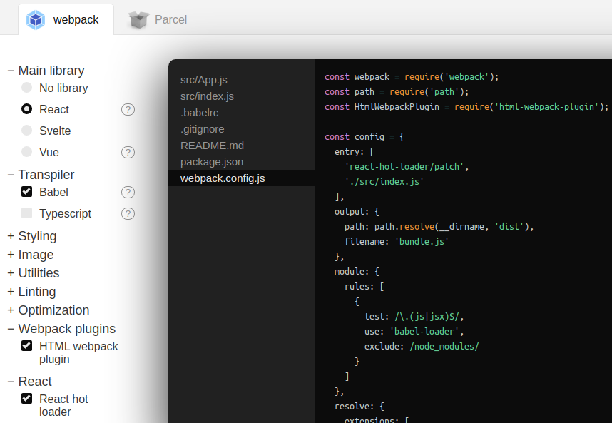

# setup-from-scratch

Here you can find the step by step to create a React app from scratch with the minimum requirements and setup.

**Requirements**:

* [Node.js](https://nodejs.org/en/) **12.16.1+** and higher
* [npm](https://nodejs.org/en/) **6.13.4+** and higher
* [npx](https://nodejs.org/en/) **6.13.4+** and higher

Before you continue, first of all you need to create a directory where the scratch code will be created.

```bash
promt$ mkdir <dir-name>
```

## Step 1

Create a Node module for a React app:

```bash
promt$ cd <dir-name>
promt$ npm init
```

The above command will be create a [package.json](./package.json) file with the Node module setup for our React app.

## Step 2

Install [React](https://www.npmjs.com/package/react) and [React DOM](https://www.npmjs.com/package/react-dom):

```bash
promt$ npm install react react-dom react-hot-loader --save
```

## Step 3

Install [Webpack](https://webpack.js.org/guides/installation/):

```bash
promt$ npm install webpack webpack-cli webpack-dev-server --save-dev
```

## Step 4

Install [Babel](https://babeljs.io/setup):

```bash
promt$ npm install babel-loader @babel/core --save-dev
```

## Step 5

Install [Babel presets](https://babeljs.io/docs/en/presets):

```bash
promt$ npm install @babel/preset-env @babel/preset-react --save-dev
```

## Step 6

Create a Webpack configuration with [createapp.dev](https://createapp.dev/webpack):



```bash
promt$ npm install @hot-loader/react-dom css-loader style-loader eslint eslint-plugin-react html-webpack-plugin html-webpack-template url-loader --save-dev
```

- Create [webpack.config.js](./webpack.config.js) in the root and copy the contents of the generated file
- Create [.babelrc](./.babelrc) in the root and copy the contents of the generated file
- Create folders src and dist and create source code files
